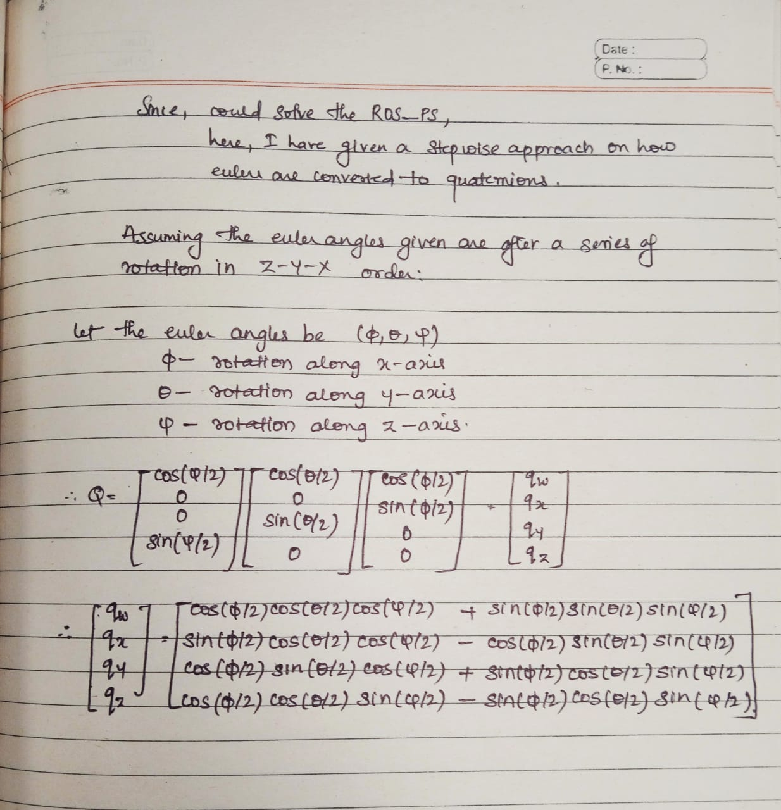

# ROS_PS
ROS (Robot Operating System) is a middleware framework designed to simplify the development of Robotic Applications. It helps the robot to communicate with the hardware sensors used. It abstracts the hardware details and provides tools for common tasks like communication and data management. Some of the main ROS Distros used today include ROS2 Humble (stable), ROS2 Noetic, ROS2 Foxy, etc.

## Question 2:
Nodes in ROS are responsible for a single, modular purpose, e.g. controlling the wheel motors or publishing the sensor data from a laser range-finder. Each node can send and receive data from other nodes via topics, services, actions, or parameters. 

Topics are like a bus to exchange messages between the nodes. It is one of the main ways in which data is moved from one node to another. It can also connect multiple nodes together.

Services too are used  to exchange data between nodes, but the main difference is, instead of being a medium to continuously transfer data with each other, service would only transfer data upon a request from the client. You cannot cancel a service while it is executing.

Actions are similar to services, but you can cancel them while executing. These are intended for long running tasks.
	
Rqt graph is a visual tool in ROS that shows how different parts (nodes) of your robot program talk to each other (topics).

Messages are the information that is getting transferred from nodes via topics, services and actions.

## Question 9:
Quaternions are a way to represent rotations in a 3D space, using a four dimensional number system to represent these. It consists of 4 real parts typically denoted by w,x,y and z, where w is the scalar part used to scale the rotation, while the x,y,z are the imaginary parts (vector) which defines the axis and angle of rotation. The magnitude of x,y,z [ √(x²+y²+z²) ] represents the amount of rotation, and a zero vector part (w≠0) represents no rotation.

Euler angles are a more intuitive way to represent the rotations in 3D space. Here the angles are described using the rotations done with respect to a particular axis of rotation (similar to pitch, yaw or roll). This mostly consists of just 3 components: φ(around z), θ(around new X), ψ(around new Y).

## Question 10:

